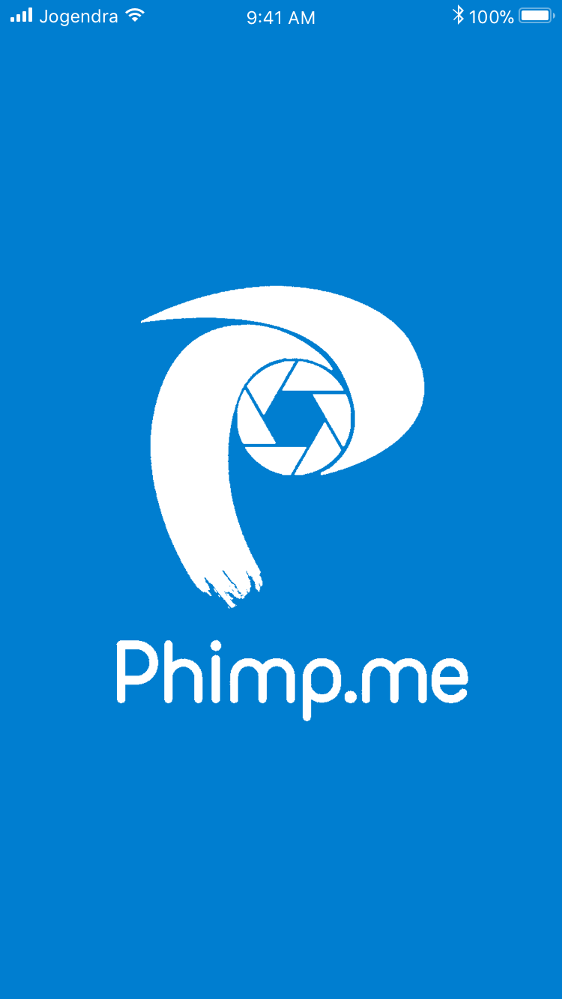
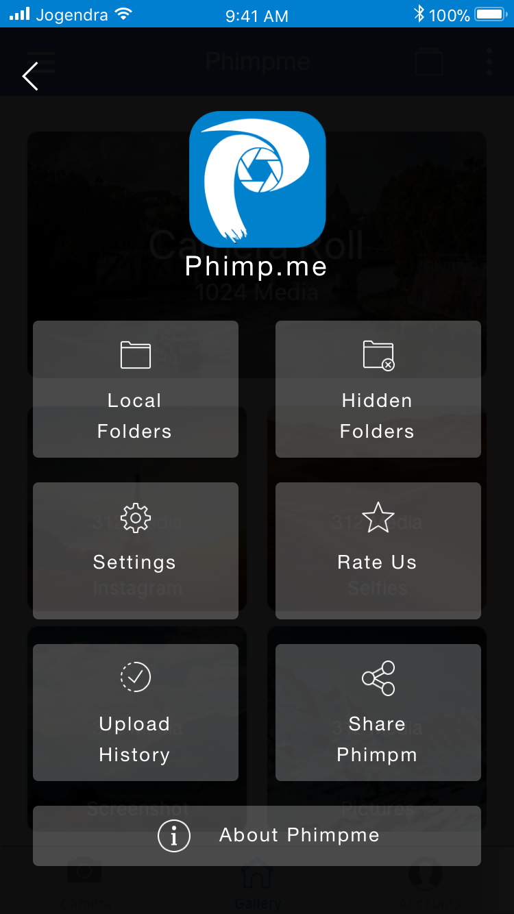
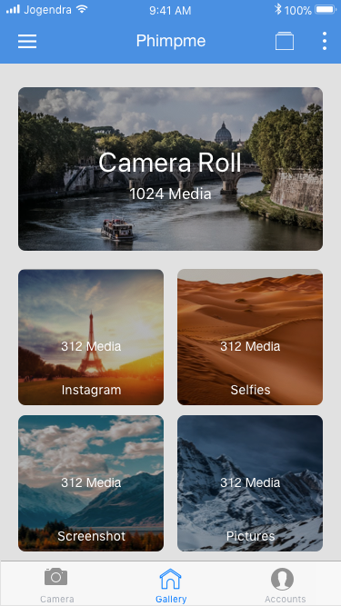
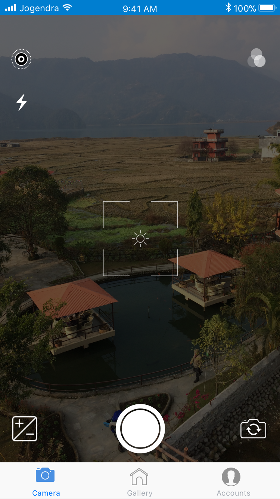
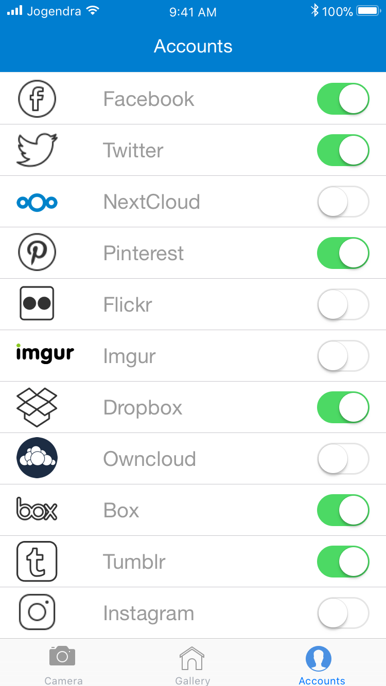
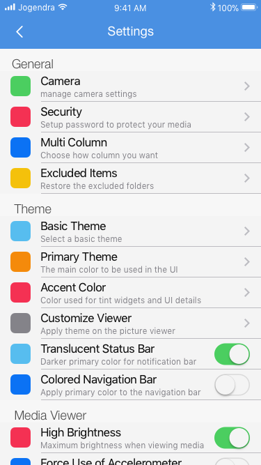
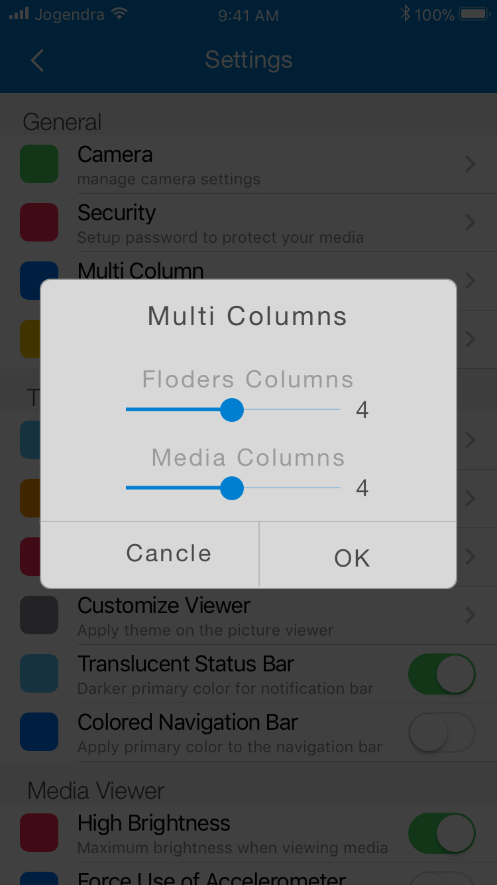
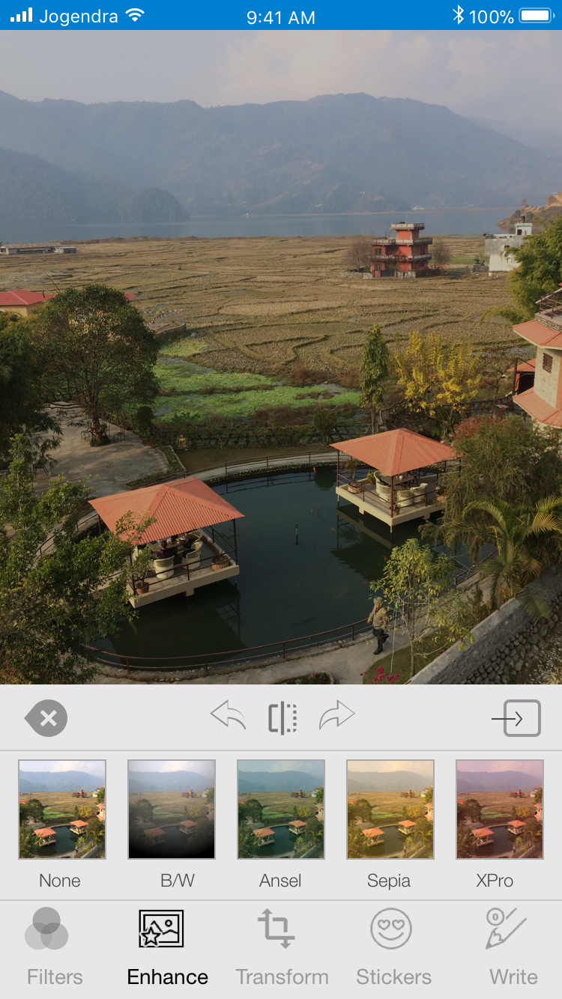

# Phimp.me iOS

Phimp.me is a Photo App for iOS that aims to replace proprietary photo applications. It offers features such as taking photos, adding filters, editing images and uploading them to social networks.

---

### Features
- [ ] Click beautiful images using the Phimp.me app. Use various advanced scene modes and variety of balance modes.

- [ ] Use your voice actions to invoke Camera, Just say "Hey Siri click a picture". You can also select front and rear camera based on voice.

- [ ] Browse the local gallery inside the app with folder and all photos mode. Copy, move and add a description to the images.

- [ ] Edit images with various cool filters with optimized performance, built using GPUImage framework.

- [ ] Enhance contrast, hue, satur, temp, tint, and sharpness of the image.

- [ ] Use 'Crop and rotate' features from Transform section to get your perfect image.

- [ ] Apply different stickers - facial, express, objects, comments, wishes, emojis, hashtag.

- [ ] Write anything on the images in your handwriting!.

- [ ] Easily go back and forth with 'redo' and 'undo'.

- [ ] Finally, after all this editing you can easily share the image to your favourite social media sites with our easy-to-use sharing feature.

- [ ] Facebook, Twitter, NextCloud, OwnCloud, Imgur, Dropbox, Box, Flickr, Pinterest, Instagram, Whatsapp, and Tumblr - You name it and we have it covered.

---

## Screenshots
Following design is using for app development:
<table>
  <tr>
    <td></td>
    <td></td>
    <td></td>
  </tr>
  <tr>
    <td></td>
    <td></td>
    <td></td>
  </tr>
  <tr>
    <td></td>
    <td></td>
    <td></td>
  </tr>
</table>

## Branch Policy

**Note:** For the initialization period all commits go directly to the master branch. In the next stages we follow the branch policy as below:

We have the following branches
* **ipa** - 
All the automatic builds generates, i.e., the ipas go into this branch
* **master** - 
This contains the stable code. After significant features/bugfixes are accumulated on development, we move it to master.
* **development** - 
All development goes on in this branch. If you're making a contribution,
you are supposed to make a pull request to _development_.
